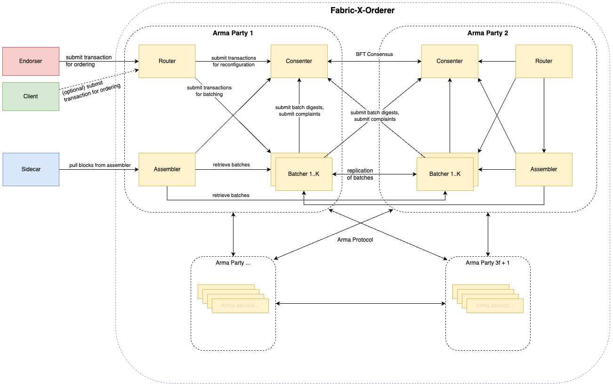

# Fabric-X

## Motivation

The adoption of Distributed Ledger Technology (DLT) for critical financial infrastructures like digital assets and currencies (e.g., Central Bank Digital Currencies (CBDCs) , stablecoins, tokenized deposits, tokenized bonds/sercurities) is hindered by a significant performance gap. Permissioned blockchains such as Hyperledger Fabric, while conceptually suitable, are limited by architectural bottlenecks in their monolithic peer design and consensus mechanisms, preventing them from achieving the required scale.

`Fabric-X` represents a fundamental re-archicture of [Hyperledger Fabric](https://github.com/hyperledger/fabric) that addresses these challenges end-to-end. The monolithic peer is decompossed into independently scalable microservices for endorsement, validation, and committing. To maximize parallelism, a transaction dependency graph was introduced. It enables safe, concurrent validation of transactions across multiple blocks. Complementing the peer redesign, we have introduced Arma, a novel sharded Byzantine Fault Tolerant (BFT) ordering service that dramatically increases throughput by ordering compact transaction digests rather than full transaction payloads. We have implemented and benchmarked this framework with a UTXO-based CBDC application. Our evaluation demonstrates a peak throughput exceeding 200,000 transactions per second (TPS) — two-orders-of-magnitude improvement over the standard implementation. 

Fabric-X proves that permissioned DLTs can be engineered for national-scale payment systems, providing a resilient and highly performant foundation for practical digital assets and currencies deployments and the integration of advanced, computationally intensive features. 

## Architecture Overview

Figure below shows the high-level architecture differences between `Fabric Classic` and `Fabric-X`.

Before we dive deep into the **differences**, we we would like to emphasize **similarities**:

**Similarities**
1. **Transaction lifecycle** - "Execute - Order - Validate"
2. **Governance model** - is implemented with endorsement policies on top of PKI (X509 certificates)
3. **mTLS authentication** - is used to establish trusted communication channels between components and network participants
4. **Membership service provider** - is Fabric-cryptogen and Fabric-CA compatible
5. **Consensus type and API** - ordering cluster provides BFT guarantees and offers same broadcast block GRPC API

**Differencies**
1. **Programming model** - classical Fabric primarily uses chaincodes to simulate transaction execution. In Fabric-X, we replace chaincodes with peer-to-peer transaction negotiation protocols built on [Fabric-Smart-Client](https://github.com/hyperledger-labs/fabric-smart-client) and [Fabric-Token-SDK](https://github.com/hyperledger-labs/fabric-token-sdk). This shift enables interactive protocols between participants, aligning with patterns already present in legacy systems.
2. **Peer decomposition** - in classical Fabric, peers handle transaction validation, commitment, and notification, among other responsibilities. This monolithic architecture limits scalability, especially when certain components become bottlenecks. In Fabric-X, we decompose the peer by offloading validation, commitment, and notification into independent, scalable microservices.
3. **Ordering service** - classical Fabric offers the following ordering service implementations: SmartBFT and RAFT. We propose an implementation based on [Arma protocol](https://arxiv.org/abs/2405.16575) a high perfmornce distributed BFT consensus.
4. **Single channel** - classical Fabric supports partitioning the blockchain into multiple channels, each with optional private data collections for participant-specific data. In contrast, Fabric-X currently supports only a single channel, which can be partitioned into namespaces, each governed by distinct endorsement policies.

### Fabric-X-Orderer

Fabric-X-Orderer 

Arma is a Byzantine Fault Tolerant (BFT) consensus system designed to achieve horizontal scalability across all hardware resources: network bandwidth, CPU, and disk I/O. As opposed to preceding BFT protocols, Arma separates the dissemination and validation of client transactions from the consensus process, restricting the latter to totally ordering only metadata of batches of transactions. This separation enables each party to distribute compute and storage resources for transaction validation, dissemination and disk I/O among multiple machines, resulting in horizontal scalability. Additionally, Arma ensures censorship resistance by imposing a maximum time limit on the inclusion of client transactions.

Arma is composed of 4 subcomponents: routers, batchers, consenters and assemblers.

- **Routers** accept transactions from submitting clients, perform some validation on the transactions, and dispatch business transactions to batchers and configuration transactions to consenter.
- **Batchers** are grouped into shards. A transaction is dispatched to a single shard. The batchers in a shard then bundle transactions into batches, and save them to disk. Batchers then send digests of the batches, called batch attestation fragments (BAF) to the consenters. The introduction of shards enables further parallelism and enables higher degrees of scalability.
- **Consenters** run a BFT consensus protocol which receives as input the BAF's from the batcher shards and provides a total order of batch attestations (BA). This induces total order among the batches and hence among TXs.
- **Assemblers** consume the stream of totally ordered batch attestations from the consensus cluster, and pull batches from the batchers. They then fuse the two sources to create a totally ordered ledger of blocks - one block for each batch.

Clients submit transactions to the routers, whereas blocks are consumed from the assemblers.

Figure below demonstrates Fabric-X-Orderer architecture.

Code and more details can be found under [Fabric-X-Orderer Github repository](https://github.com/hyperledger/fabric-x-orderer).

### Fabric-X-Committer

Fabric-X-Commiter is responsible for post-ordering transaction processing. It has a microservice architecture comprised of the following subcomponents: sidecar, coordinator, validator-committer, verification service, query service.

- **Sidecar** is a middleware component designed to operate between an Ordering Service and the Coordinator component. Its primary function is to reliably manage the flow of blocks, ensuring they are fetched, validated, persisted, and delivered to downstream clients.
- **Coordinator** service acts as the central orchestrator of the transaction validation and commit pipeline. It sits between the Sidecar and a collection of specialized verification, validation and commit services. Its primary role is to manage the complex flow of transactions, from initial receipt to final status reporting, by leveraging a transaction dependency graph to maximize parallel processing while ensuring deterministic outcomes.
- **Verification Service** is responsible for validating transaction signatures against namespace policies. It ensures that only properly authorized transactions are committed to the state database by verifying signatures against the appropriate policies.
- **Validator-Committer Service** is a component responsible for the final stages of transaction processing. Its primary function is to perform optimistic concurrency control by validating each transaction's read-set against the current state in the database. Transactions that pass this validation are then committed, and their write-sets are applied to the database.
- **Query Service** provides efficient, consistent read-only access to the state database. It implements a view-based query mechanism that allows clients to retrieve data with specific isolation guarantees while optimizing database access through sophisticated batching techniques

Figure below demonstrates the Fabric-X-Committer architecture.

Code and more details can be found under [Fabric-X-Committer Github repository](https://github.com/hyperledger/fabric-x-committer).

## Run the network

To set up the network yourself, follow the tutorial in the [sample deployment scripts](https://github.com/LF-Decentralized-Trust-labs/fabric-x-ansible-collection) repository. It provides Ansible scripts with predefined inventories and playbooks for both local and remote cluster deployments. Support for deploying a sample application will be added soon.

## Useful links

- [Yotube webinar](https://www.youtube.com/live/gdQh-mNKSKA?si=dJT8jU9M4NO6csRq) - introduction into Fabric-X
- [Fabric-X Blog](https://www.lfdecentralizedtrust.org/blog/new-major-contribution-to-hyperledger-fabric-purpose-built-implementation-for-next-gen-digital-assets)
- [Fabric-X whitepaper](https://eprint.iacr.org/2023/1717.pdf) - detailed description of the Fabric-X. Explains motivation,implementation details and presents performance benchmarks
- [Fabric-X Committer](https://github.com/hyperledger/fabric-x-committer) Github repository
- [Fabric-X Orderer](https://github.com/hyperledger/fabric-x-orderer) Github repository
- [Fabric-X Endorser](https://github.com/hyperledger/fabric-x-endorser)
- [Fabric-Token-SDK](https://github.com/hyperledger-labs/fabric-token-sdk) and [Fabric-Smart-Client](https://github.com/hyperledger-labs/fabric-smart-client) Github repositories
- [Fabrix-X Common](https://github.com/hyperledger/fabric-x-common) Github repository - contains new CLIs and protobufs
- [Sample deployment scripts](https://github.com/LF-Decentralized-Trust-labs/fabric-x-ansible-collection)

## Coming soon...

- [ ] Sample application on top of Fabric-X
- [ ] Fabric-X Kubernetes Operator
